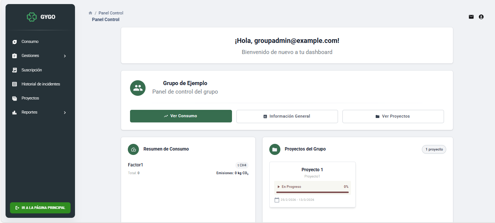
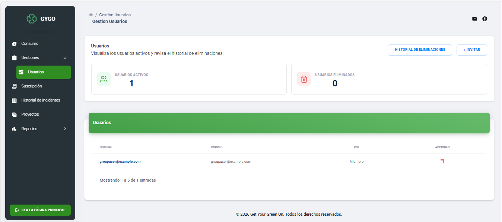
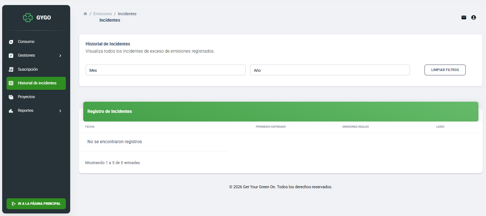
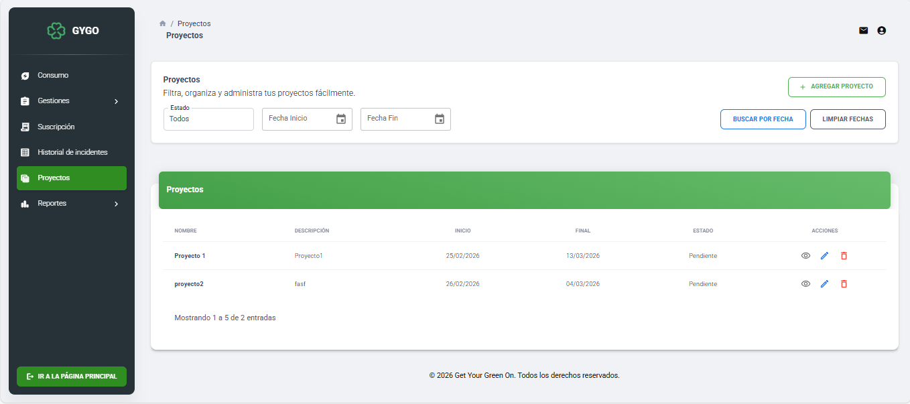
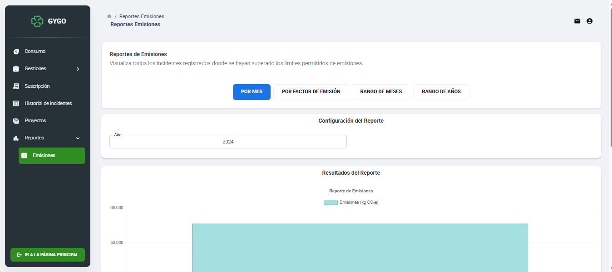

# 🚀 Gygo

> Plataforma web para la gestión y monitoreo de proyectos, usuarios e incidentes en tiempo real.

---

## 📋 Tabla de contenidos

- [Descripción](#-descripción)
- [Funcionalidades principales](#-funcionalidades-principales)
- [Tecnologías](#-tecnologías)
- [Capturas de pantalla](#-capturas-de-pantalla)
- [Instalación y setup](#-instalación-y-setup)
- [Variables de entorno](#-variables-de-entorno)
- [Licencia](#-licencia)

---

## 📖 Descripción

**Gygo** es una aplicación web fullstack diseñada para centralizar la gestión operativa de equipos y proyectos. Permite a los administradores tener visibilidad completa sobre el estado de sus proyectos, los usuarios del sistema, los incidentes registrados y generar reportes detallados — todo desde un único panel de control.

---

## ✨ Funcionalidades principales

| Módulo | Descripción |
|---|---|
| 🖥️ **Panel de control** | Vista general con métricas clave, indicadores de estado y actividad reciente |
| 👥 **Usuarios** | Gestión completa de usuarios: creación, edición, roles y permisos |
| ⚠️ **Historial de incidentes** | Registro y seguimiento de incidentes con estado, prioridad y responsable |
| 📁 **Proyectos** | Administración de proyectos con asignación de equipo y seguimiento de avance |
| 📊 **Reportes** | Generación de reportes filtrables por fecha, proyecto, usuario e incidente |

---

## 🛠 Tecnologías

### Frontend
- **React 18** con **Vite** — SPA rápida y moderna
- **React Router DOM** — Navegación entre vistas
- **Axios** — Consumo de la API REST

### Backend
- **.NET 8** — API RESTful
- **Entity Framework Core** — ORM para acceso a datos
- **AutoMapper** — Mapeo de DTOs y entidades

### Base de datos
- **SQL Server** — Base de datos relacional

---

## 📸 Capturas de pantalla

### 🖥️ Panel de control

### 👥 Usuarios

### ⚠️ Historial de incidentes

### 📁 Proyectos

### 📊 Reportes

## 📄 Licencia

Este proyecto está bajo la licencia [MIT](./LICENSE).
